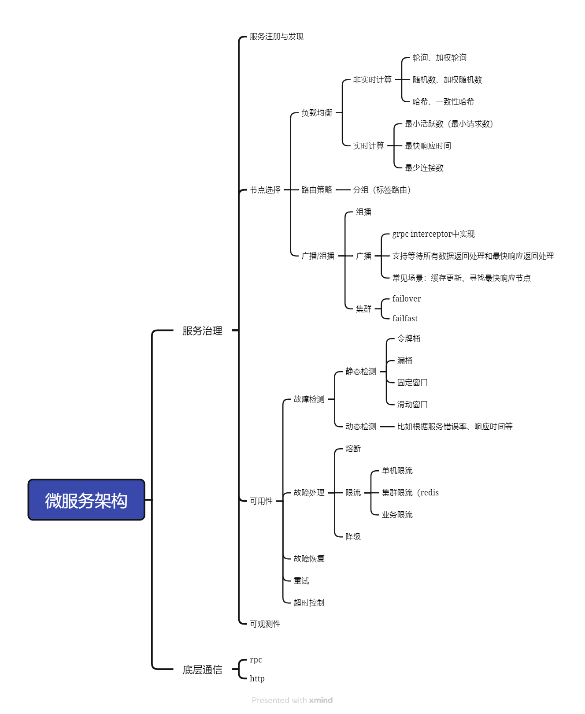
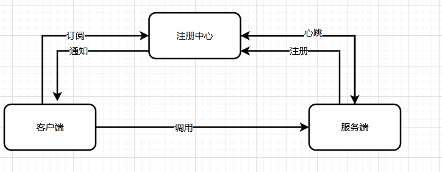

# 微服务架构概览

## 大纲

## 概览

## 服务注册与发现

### 关键问题

#### 运行过程中，客户端连不上注册中心怎么办？

可能是网络问题、注册中心崩溃等

从一致性的角度考虑，客户端立即终止服务调用，直到与注册中心恢复连接

从可用性的角度考虑，客户端继续服务，并尝试重新连接注册中心，这段时间使用缓存数据。一段时间连接不上后，再终止服务

#### 运行过程中，客户端拿到了注册数据，但是连不上对应的服务端怎么办？

可能是因为客户端和服务端中有防火墙，当服务端连接不上时，客户端需要从本地的可用节点列表中移除相应的服务实例；等服务恢复后，再加入节点列表中

#### 注册中心崩溃了，客户端和服务端怎么办？

这个问题相当于客户端连接不上注册中心，详见问题1：**运行过程中，客户端连不上注册中心怎么办？**

#### 服务端崩溃之后，客户端多久才能知道？

取决于服务端和注册中心的交互方式：

若是服务端主动续约，没有心跳的情况：取决于租约超时时间和注册中心租约超时重试机制

若是注册中心主动与服务端保持心跳的情况：取决于心跳重试的次数和间隔

#### 容器内部 IP 问题

在示例的etcd中是使用ip+端口来识别服务实例的。若微服务运行在docker容器中，那ip永远是localhost.

解决方案：

1. 使用容器专属服务注册与发现方式
2. 容器启动时使用宿主机网路，而不是创建虚拟网络
3. 容器启动时将宿主机ip作为环境变量注入

#### 服务端和注册中心连不上了怎么办？

服务端重试，直到连上，输出错误日志。一般来说，服务端不会因为和注册中心连接不上就停止服务。注册中心连接不上服务端会进行重试，若多次重试连接不上，就认为服务端挂了，通知客户端

## 可用性

### 故障处理

#### 拒绝策略 

##### 分快路径和慢路径

比如缓存模式下，正常情况下，缓存中查不到就查询数据库；当触发限流后，缓存中查不到可以返回默认值或错误 

##### 直接返回固定响应

触发限流后直接返回固定响应这一步可以在服务拦截器里实现 

##### 缓存请求，等待唤醒

比如令牌桶、漏洞 

##### 转为异步模式

当触发限流后，服务接收到请求直接返回202，再异步处理请求 

##### 转发到别的服务器

可以结合failover考虑，返回客户端302重定向，让客户端重新找一个可用节点

## 集群failover注意事项

重试时，注意: 

- 什么情况下进行重试，超时时可考虑重试，失败时可考虑直接返回； 
-  是否更换节点 
- 已失败节点从可用列表中移除 
- 重试次数 
- 重试时间间隔：等时间间隔、退避算法

## 手写rpc源码

https://github.com/skylar2826/go-rpc

## 服务治理demo

https://github.com/skylar2826/go-register